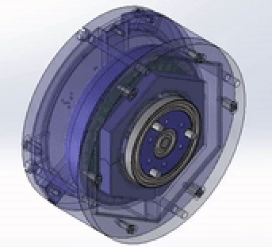
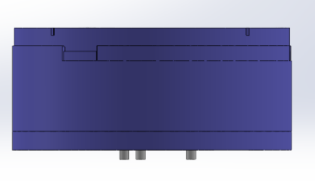
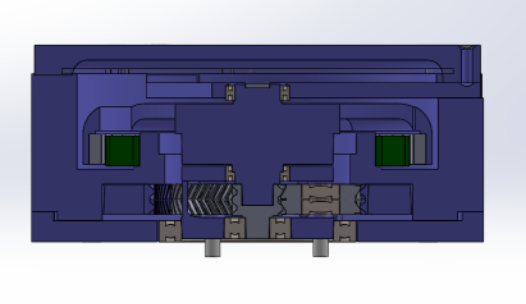

# Introduction

This repository contains the drawings, electronics schematics, firmware
and building instructions for a (almost) completely 3D printed robotic
actuator. The actuator is based in a 36 stator poles and 42
rotor/magnetic poles BLCD, whose output is attached to a 6:1 planetary
gearbox.

Views:

|||
|-----------------------------------------------|-------------------------------------| 
|           |   |

# Bill of Materials

  |Part Number   |  Part    |        Part Description    |    Quantity|
  ---------------|----------|---- -----------------------|------------|
  |1              | 30x5 mm steel pin   |Steel pins to improve torque transmsion|   3|
  |2               |61810-2RS|       50 x 65 x 7 mm ball bearing |     2|
  |3               |608-2RS|         8 x 22 x 7 mm ball  bearing|     2|
  |4               |61802-2RS |      15 x 24 x 5 mm ball bearing|    2|
  |5               |625-2RS1-SKF|    5 x 16 x 5 mm ball bearing|      6|
  |6               |Rotor Magnet|    10 x 4 x R51.5 mm  curved neodymium magnet|      42|
  |8              |M3 screw |       Torx flat head 10 mm screw|    3|
  |9               |M3 screw|        Torx flat head 14 mm screw|    6|
  |10              |M3 screw |       Torx flat head 20 mm screw|   3|
  |11              |10010 stator|    100mm x 78 mmx 10mm, 36 slots, steel stator|  1|

  : Bill of materials

# Controller

  ---------------------------------------------- --------------------------------------------
    
  ---------------------------------------------- --------------------------------------------

|No.|Quantity|Comment       |Designator                                            |Footprint                          |Value|Manufacturer Part             |Manufacturer             |Supplier Part|Supplier|
|---|--------|--------------|------------------------------------------------------|-----------------------------------|-----|------------------------------|-------------------------|-------------|--------|
|1  |16      |10uF          |C1,C2,C3,C4,C5,C6,C7,C8,C9,C10,C11,C12,C13,C14,C15,C16|C1206                              |     |CL31A106KBHNNNE               |SAMSUNG                  |C13585       |LCSC    |
|2  |5       |4.7uF         |C17,C18,C19,C20,C23                                   |C0805                              |     |CS2012X7R475K350NRE           |SamwhaCapacitor          |C560882      |LCSC    |
|3  |1       |10nF          |C21                                                   |C0603                              |     |CT41G-0603-2X1-50V-0.01uF-K(N)|TORCH                    |C136131      |LCSC    |
|4  |2       |10uF          |C22,C37                                               |CAP-TH_BD5.0-P2.00-D0.8-FD         |     |10uF50V5*7                    |ValuePro                 |C45669       |LCSC    |
|5  |3       |100nF         |C24,C25,C26                                           |C0805                              |     |CL21F104ZBCNNNC               |SAMSUNG                  |C1760        |LCSC    |
|6  |1       |10nF          |C27                                                   |C0402                              |     |CL05B103KB5NNNC               |SAMSUNG                  |C15195       |LCSC    |
|7  |1       |1uF           |C28                                                   |C0603                              |     |CL10A105KB8NNNC               |SAMSUNG                  |C15849       |LCSC    |
|8  |1       |22nF          |C29                                                   |C0603                              |     |CL10B223KB8NNNC               |SAMSUNG                  |C21122       |LCSC    |
|9  |1       |100nF         |C30                                                   |C1206                              |     |CL31B104KCFNNNE               |SAMSUNG                  |C1945        |LCSC    |
|10 |3       |470nF         |C31,C32,C33                                           |C0805                              |     |GRM21BR71C474KA01L            |MurataElectronics        |C408143      |LCSC    |
|11 |1       |100nF         |C34                                                   |C0603                              |     |GRM188R71H104KA93D            |MuRata                   |C77055       |LCSC    |
|12 |1       |100nF         |C35                                                   |C0603                              |     |GRM188R71E104KA01D            |MuRata                   |C77050       |LCSC    |
|13 |1       |10uF          |C36                                                   |C1210                              |     |CL32B106KAJNNNE               |SAMSUNG                  |C39232       |LCSC    |
|14 |2       |22pF          |C38,C39                                               |C0805                              |     |CL21C220JBANNNC               |SAMSUNG                  |C1804        |LCSC    |
|15 |1       |SIP2-2.54MM双排针|HDR1                                                  |HDR-TH_2P-P2.54-V-M-R2-C1-S2.54    |     |SIP2-2.54mm双排针                |null                     |C9900003705  |LCSC    |
|16 |1       |NC5MAV        |PS1                                                   |CONN-TH_NC5MAV                     |     |NC5MAV                        |NEUTRIK(优曲克)             |C368510      |LCSC    |
|17 |6       |IRF7470TRPBF  |Q1,Q2,Q3,Q4,Q5,Q6                                     |SO-8_L4.9-W3.9-P1.27-LS5.9-BL      |     |IRF7470TRPBF                  |InfineonTechnologies     |C386356      |LCSC    |
|18 |1       |0             |R1                                                    |R0603                              |     |ERJ-3GEY0R00V                 |PANASONIC                |C122704      |LCSC    |
|19 |6       |2.2           |R2,R3,R4,R5,R6,R7                                     |R0603                              |     |RC0603FR-072R2L               |YAGEO                    |C112307      |LCSC    |
|20 |6       |0.03          |R8,R9,R10,R11,R12,R13                                 |R2512                              |     |MRF6432(2512)LR030FTS         |SUP                      |C76247       |LCSC    |
|21 |3       |10            |R14,R15,R16                                           |R0603                              |     |ERJ-3EKF10R0V                 |PANASONIC                |C193335      |LCSC    |
|22 |1       |10K           |R17                                                   |R0402                              |     |RMC10K103FTH                  |KAMAYA                   |C323692      |LCSC    |
|23 |1       |STM32F411CEU6 |U1                                                    |UFQFPN-48_L7.0-W7.0-P0.50-BL-EP    |     |STM32F411CEU6                 |STMicroelectronics       |C60420       |LCSC    |
|24 |1       |TMC6200-TA    |U2                                                    |TQFP-48_L7.0-W7.0-P0.50-LS9.0-BL-EP|     |TMC6200-TA                    |TRINAMICMotionControlGmbH|C915798      |LCSC    |
|25 |1       |MCP2515T-I/SO |U3                                                    |SOIC-18_L11.6-W7.5-P1.27-LS10.3-BL |     |MCP2515T-I/SO                 |MICROCHIP                |C153782      |LCSC    |
|26 |1       |AS5048A-HTSP  |U4                                                    |TSSOP-14_L5.0-W4.4-P0.65-LS6.4-BL  |     |AS5048A-HTSP                  |美国AMS                    |C2153638     |LCSC    |
|27 |3       |SEW_HOLE      |U5,V1,W1                                              |SIMPLE_HOLE                        |     |                              |                         |             |        |
|28 |1       |LD1086DT33TR  |U6                                                    |TO-252-2_L6.5-W6.1-P4.58-LS10.0-TL |     |LD1086DT33TR                  |STMicroelectronics       |C12051       |LCSC    |
|29 |1       |32.768KHz     |X1                                                    |FC-135R_L3.2-W1.5                  |     |Q13FC1350000400               |EPSON                    |C32346       |LCSC    |
|30 |1       |25MHz         |X2                                                    |HC-49US_L11.5-W4.5-P4.88           |     |XIHCELNANF-25MHZ              |TAITIENElec              |C295079      |LCSC    |
|31 |1       |10MHz         |X3                                                    |HC-49-SMD_L12.0-W4.8               |     |HC-49SM10MHz20pF30ppm         |ZhejiangAbelElec         |C150559      |LCSC    |

# Firmware
The firmaware is developed with the Arduino IDE for the STM32 boards. It implements the Finite State Machine shown in the Fig 1, where (X) indicates state number and [X] the transition number. For the low level motion control the firmaware use the  Field Oriented Control (FOC) algorithm for Arduino [SimpleFOC](https://simplefoc.com/) The following dependencies  required:

* [SimpleFOC Arduino library](https://github.com/simplefoc/Arduino-FOC)
* [Library for CAN comunication](https://github.com/autowp/arduino-mcp2515/)
* [Finite State Machine library](https://github.com/kiwisincebirth/Arduino/blob/master/libraries/FSM/FiniteStateMachine.h)
*  [Custom can messages parser](/firmware/can_parser.zip)

 <figure>
  
  <figcaption>Fig 1. Finite Sate Machine of the actuator.</figcaption>
</figure> 

## CAN Protocol

|Frame |Signal|Bit Position|Bit Length|Scale|Offset|Units|Notes                 |
|------|------|------------|----------|-----|------|-----|----------------------|
|0x001 |      |<ul><li>0</li><li>16</li><li>32</li></ul>|<ul><li>16</li><li>16</li><li>16</li></ul>|<ul><li>0.125</li><li>0.125</li><li>0.125</li></ul>|<ul><li>0</li><li>0</li><li>0</li></ul>|<ul><li>-</li><li>-</li><li>-</li></ul>|<ul><li>P value for the PID position control</li><li>I value for the PID position control</li><li>D value for the PID position control</li></ul>|
|0x002 |      |<ul><li>0</li><li>16</li><li>32</li><li>48</li></ul>|<ul><li>16</li><li>16</li><li>16</li><li>16</li></ul>|<ul><li>0.125</li><li>0.125</li><li>0.125</li><li>0.125</li></ul>|<ul><li>0</li><li>0</li><li>0</li><li>0</li><li></ul>|<ul><li>-</li><li>-</li><li>-</li><li>rad/s</li></ul>|<ul><li>P value for the PID speed control</li><li>I value for the PID speed control</li><li>D value for the PID speed control</li><li>Speed limit</li></ul>|
0x003 |      |<ul><li>0</li><li>16</li><li>32</li><li>48</li></ul>|<ul><li>16</li><li>16</li><li>16</li><li>16</li></ul>|<ul><li>0.125</li><li>0.125</li><li>1</li><li>0.125</li></ul>|<ul><li>0</li><li>0</li><li>0</li><li>-4095</li><li></ul>|<ul><li>V</li><li>V</li><li>-</li><li>rad</li></ul>|<ul><li>Voltage limit for motor input</li><li>Voltage limit for aling in calibration</li><li>Calibration (1 skip, o calibrate)</li><li>Electric angle offset </li></ul>|
0x004 |      |<ul><li>0</li><li>16</li><li>32</li><li>48</li></ul>|<ul><li>16</li><li>16</li><li>16</li><li>16</li></ul>|<ul><li>0.125</li><li>0.125</li><li>1</li><li>0.125</li></ul>|<ul><li>-4095</li><li>-4095</li><li>-4095</li><li>-4095</li><li></ul>|<ul><li>V</li><li>V</li><li>I</li><li>rad</li></ul>|<ul><li>Ua component of voltage input</li><li>Ub component of voltage input</li><li>Current drawn by motor</li><li>Electric angle  </li></ul>|
0x005 |      |<ul><li>0</li><li>16</li><li>32</li></ul>|<ul><li>16</li><li>16</li><li>16</li></ul>|<ul><li>0.125</li><li>0.125</li><li>0.125</li></ul>|<ul><li>-4095</li><li>-4095</li><li>-4095</li><li></ul>|<ul><li>rad</li><li>rad</li><li>rad/s</li></ul>|<ul><li>Current mechanical angle</li><li>Mechanical angle setponit</li><li>Shaft speed</li></ul>|
0x006 |      |<ul><li>0</li></ul>|<ul><li>16</li></ul>|<ul><li>1</li></ul>|<ul><li>0</li></ul>|<ul><li>-</li></ul>|<ul><li>Finite State Machine transition</li></ul>|
0x007 |      |<ul><li>0</li></ul>|<ul><li>16</li></ul>|<ul><li>0.125</li></ul>|<ul><li>-4095</li></ul>|<ul><li>rad</li></ul>|<ul><li>Motor set point command</li></ul>|

## DRIVERS
Custom [Python](https://github.com/ManuelSanchezMo/Robotic_actuator_python_driver) and [ROS](https://github.com/ManuelSanchezMo/Robot_actuator_ROS_driver)  drivers are available for the device. 
# Buildin Instructions
