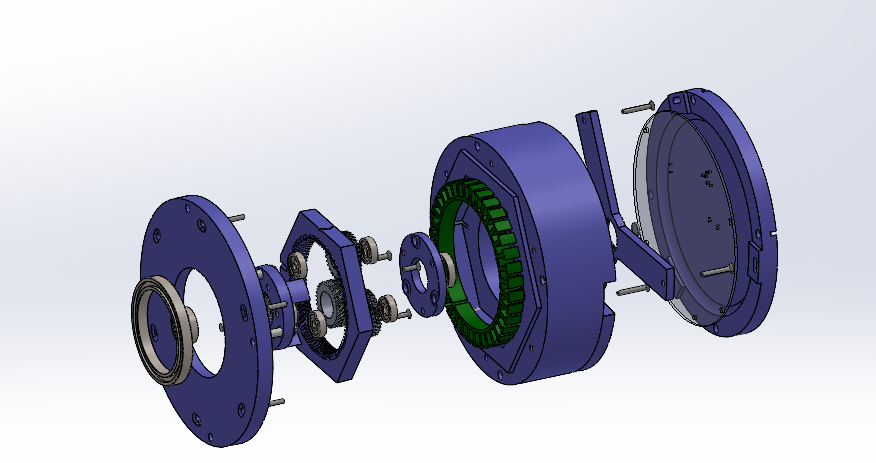

Introduction
------------
Views:
    .. image:: ./imgs/rotating.gif
          :target: ./imgs/side
          :alt: side
          :width: 300

    .. image:: ./imgs/side.PNG
          :target: ./imgs/side
          :alt: side
          :width: 300

    .. image:: ./imgs/front.PNG
          :target: ./imgs/front
          :alt: front
          :width: 300

    .. image:: ./imgs/Cut.PNG
          :target: ./imgs/Cut
          :alt: Cut
          :width: 300

Bill of Materials
-----------------

.. list-table:: Title
   :widths: 50 50 75 50
   :header-rows: 1

   * - Part Number
     - Part
     - Part Description
     - Quantity
   * - 1
     - 30x5 mm steel pin
     - Steel pins to improve torque transmsion.
     - 3
   * - 2
     - 61810-2RS
     - 50 x 65 x 7 mm ball bearing
     - 2
   * - 3
     - 608-2RS
     - 8 x 22 x 7 mm ball bearing
     - 2
   * - 4
     - 61802-2RS
     - 15 x 24 x 5 mm ball bearing
     - 2
   * - 5
     - 625-2RS1-SKF
     - 5 x 16 x 5 mm ball bearing
     - 6
   * - 6
     - Rotor Magnet
     - 10 x 4 x R51.5  mm curved neodymium magnet
     - 42
   * - 8
     - M3 screw
     - Torx flat head 10 mm screw
     - 3
   * - 9
     - M3 screw
     - Torx flat head 14 mm screw
     - 6
   * - 10
     - M3 screw
     - Torx flat head 20 mm screw
     - 3
   * - 11
     - 10010 stator
     - 100mm x 78 mmx 10mm, 36 slots, steel stator
     - 1

Controller
----------
CAN Protocol
------------

Buildin Instructions
--------------------
